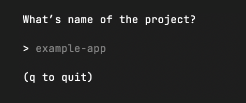

<p align="center">
    
</p>

# Lemonade

CLI for setting up projects

## Installation

Install `lemonade` into your local machine.

<details>
<summary><b>Prerequisites</b>: Go v1.16+</summary>

[Download Go from golang.org](https://golang.org/doc/install)

</details>

#### Clone project from Github

```bash
git clone https://github.com/d-exclaimation/lemonade.git
```

#### Get all dependencies

```bash
go mod download
```

#### Compile to binary

```bash
# Install to machine
go install

# Compile

go build -o lemonade .
```

## Usage/Examples

1. Run the CLI

```bash
lemonade
```

2. Choose the programming language of choice

3. Choose the available template

4. Name the project



5. Done!


